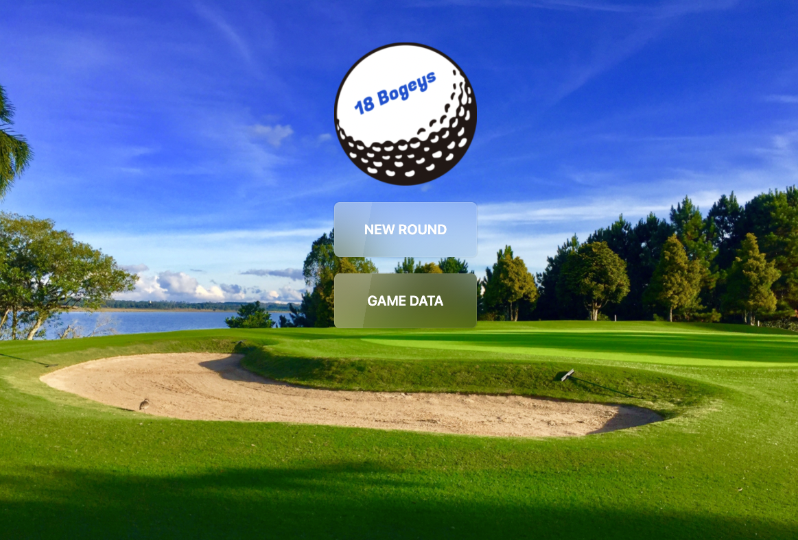
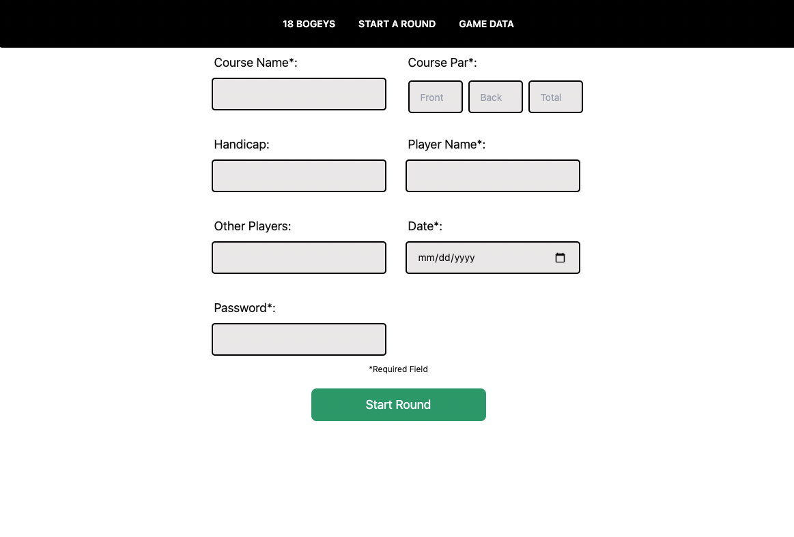
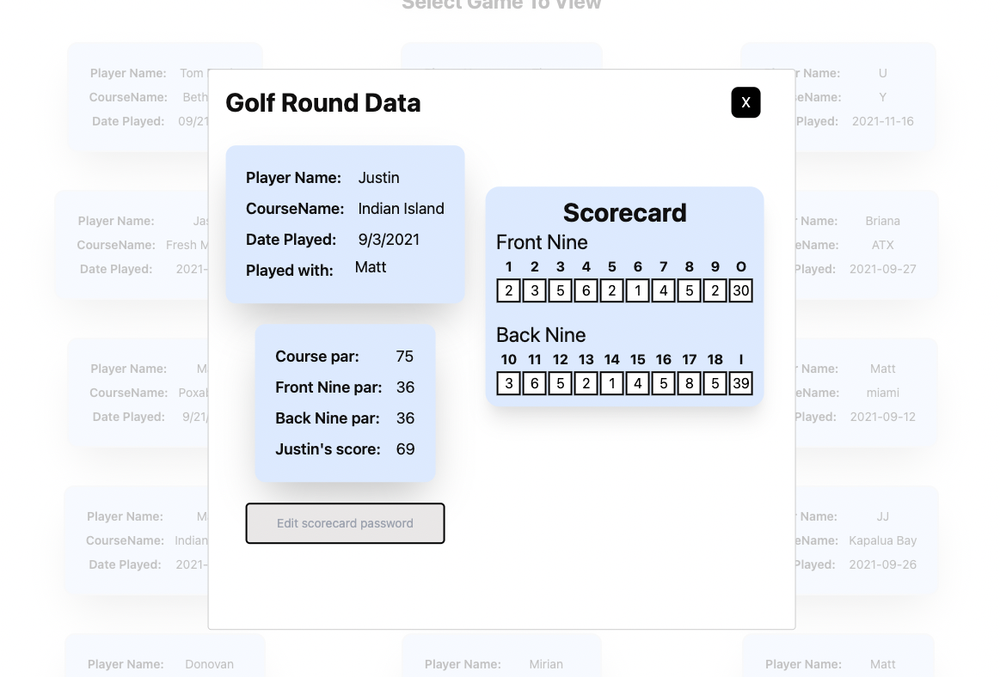

# 18-Bogeys

# [Link to project here](https://18bogeys.netlify.app/)

## Project Description

18 Bogeys is a golf round tracker that records various info about your golf game. It will record the course name and par, your name, handicap an the other players you are playing with as well as the date played. In addition you will fill in the scorecard as you play and at the end of the game you will submit it to a global feed.

## Final Project View

### Landing Page

### New Round Creation

### Round Data



## Wireframes

The wireframes below depict the phone and website view for the app as well as the flowchart to depicte the component Hierarchy. Disclaimer, as seen above the final website have changed overtime and the wireframes haven't been updated. [View the source here.](https://whimsical.com/18-bogeys-MaEEdCsgf13WMQCcW74rcKß)


## Component Hierarchy


## API and Data Sample

[View database here!](https://airtable.com/shrpS72muo5RzImLc)

Airtable is returning the data for this base as follows:

```
{
    "records": [
        {
            "id": "recpcERi4gK15rKvo",
            "fields": {
                "courseName": "Swan Lake",
                "coursePar": "75",
                "playerName": "Matt Moyka",
                "handicap": "-4",
                "otherPlayers": "Justin",
                "date": "9/1/2021"
            },
            "createdTime": "2021-09-17T13:10:59.000Z"
        }
    ],
    "offset": "recpcERi4gK15rKvo"
}

```

### MVP/PostMVP

#### MVP

- Home page with clickable icons that route to each respective form or data.
- Get and post golf data from Airtable.
- Use forms to create game data and update Airtable.
- edit posts from the game feed through airtable.

#### PostMVP

- add a password bar to allow creator to delete, no secure just like a if(x === x)axios Delete input
- Add a search bar to search games by name
- Added modals instead of new pages in certain areas


## Project Schedule

| Day      | Deliverable                                | Status   |
| -------- | ------------------------------------------ | -------- |
| Sept 16,17 | Proposal Approval / Airtable Setup         | Complete |
| Sept 18-20   | Component Creation / Get, Set, Delete Data | Complete |
| Oct 21   | finish axios/ finish forms / CSS Components            | Complete |
| Oct 22   | CSS Components / MVP Complete               | Complete |
| Oct 23   | Advanced CSS                               | Complete |
| Oct 24   | Presentations                              | Complete |

## Timeframes

| Component                 | Priority | Estimated Time | Time Invested | Actual Time |
| ------------------------- | :------: | :------------: | :-----------: | :---------: |
| Proposal                  |    H     |      2hrs      |      2hrs     |    2hrs     |
| Airtable setup            |    H     |     .5hrs      |       .5hrs    |     .5hrs     |
| Netlify           |    H     |      1hrs      |    1.5hrs        |   1hrs       |
| Data population pg 1      |    H     |      3hrs      |     3hrs      |    3hrs     |
| Data population pg 2      |    H     |      3hrs      |    3hrs      |    3hrs     |
| Data population pg 3      |    H     |      3hrs      |    3hrs      |    3hrs     |
| Data population pg 4      |    H     |      3hrs      |      3hrs    |    3hrs     |
| Data population pg 5      |    H     |      3hrs      |    3hrs     |    3hrs     |
| Form creation pg 1,2        |    H     |      2hrs      |    2hrs     |    2hrs    |
| Form creation pg 3,4        |    H     |      2hrs      |     2hrs     |    2hrs    |
| Data creation/update pg 1 |    H     |      3hrs      |    3hrs      |     3hrs    |
| Data creation/update pg 3 |    H     |      3hrs      |      3hrs   |     3hrs     |
| Component CSS pg 1        |    H     |      3hrs      |     3hrs     |    3hrs     |
| Component CSS pg 2        |    H     |      3hrs      |    3hrs      |    3hrs     |
| Component CSS pg 3        |    H     |      3hrs      |     3hrs     |    3hrs     |
| Component CSS pg 4        |    H     |      3hrs      |     3hrs     |    3hrs     |
| Component CSS pg 5        |    H     |      3hrs      |     3hrs     |     3hrs    |
| Total                     |    H     |    42.5hrs     |     43hrs     |    43hrs    |

## SWOT Analysis

### Strengths:

I have a good understanding of what i want my application to look like and what exactly I want it to do. I am also an avid golfer so I feel that I can deliver all the necessary info a golfer would want.

### Weaknesses:

There is a lot of posting and patching in the app and I am going to have to figure out how to connect it all. For example I have a form that is filled out submitted and then brings the user to another form thats going to add data to the first form.

### Opportunities:

This project will give me a great understanding of react and linking forms and storing data in a no code database. I will also use tailwind CSS for the styling on this project.

### Threats:

If I run into more errors than anticipated I will not be able to complete all the MVP features I want.


## Code Snippet:
```
return (
    <div className='bg-white text-black'>
      <div className='flex justify-between mx-5 mb-10'>
        <div className='text-2xl font-bold'>Search Results</div>
        <button onClick={props.closeModal} className='flex justify-center items-center p-3 bg-black text-white h-9 rounded-lg'>X</button>
      </div>
      <div className='flex flex-wrap gap-5 '>
        {props.games.map(game => {
          if (game.fields?.playerName.toLowerCase() === props.searchInput.toLowerCase()) {
            return (
              <div key={game?.id}>
                <button onClick={openModal} id={game.id} className='flex flex-row w-auto h-10/12 p-5 bg-blue-100 hover:bg-green-500 hover:text-white shadow-2xl border-black gap-1 mb-5 mx-5 border-2 rounded-xl text-sm'>
                  <div>
                    <div id={game.id} className='p-1 font-semibold '>Player Name:</div>
                    <div id={game.id} className='p-1 font-semibold '>CourseName:</div>
                    <div id={game.id} className='p-1 font-semibold '>Date Played:</div>
                  </div>
                  <div id={game.id} className=''>
                    <h3 id={game.id} className='p-1'>{game.fields.playerName}</h3>
                    <h4 id={game.id} className='p-1'>{game.fields.courseName}</h4>
                    <div id={game.id} className='p-1'>{game.fields.date}</div>
                  </div>
                </button>
              </div>
            )
          } else {
            return null
          }
        })}</div>
```

## Dependencies
```
  "dependencies": {
    "@craco/craco": "^6.3.0",
    "@testing-library/jest-dom": "^5.14.1",
    "@testing-library/react": "^11.2.7",
    "@testing-library/user-event": "^12.8.3",
    "axios": "^0.21.4",
    "daisyui": "^1.14.0",
    "react": "^17.0.2",
    "react-dom": "^17.0.2",
    "react-modal": "^3.14.3",
    "react-router-dom": "^5.3.0",
    "react-scripts": "4.0.3",
    "web-vitals": "^1.1.2"
  }
```


